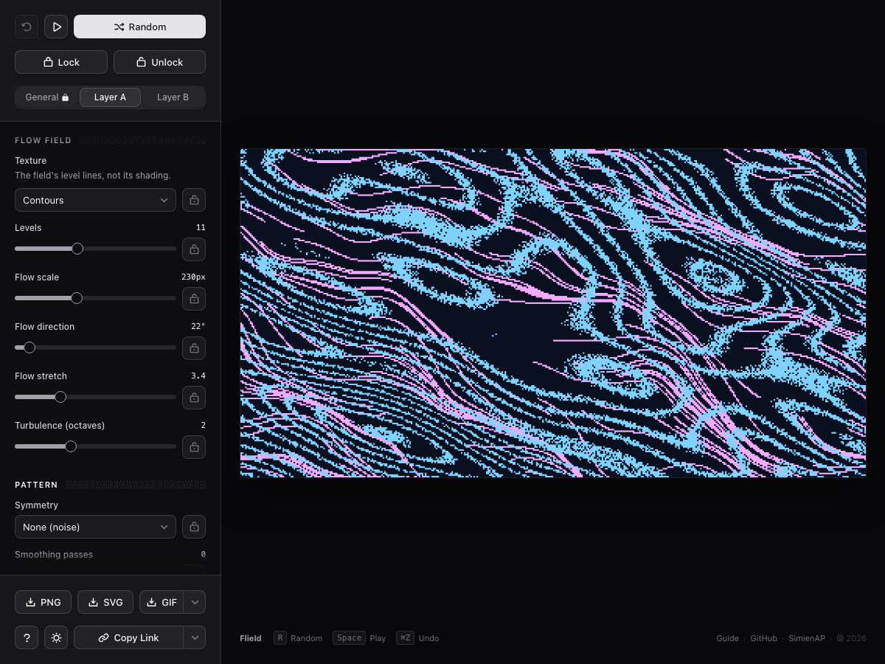

# Flowgrain

A browser-based generative pixel art tool for creating unique three-color compositions (a background plus two artwork layers) from seeded flow fields and symmetry.

## Live demo

[https://simien.github.io/flowgrain/](https://simien.github.io/flowgrain/)

## Screenshot

## Why

I built this to generate images and placeholder graphics without reaching for stock photos or a design tool every time. Swap in a brand color palette, seed a batch of variations, and export the one that fits. The GIF export works well as a subtle animated background or hover state.

The generator itself (`generator.js`) is independent of the UI, so the noise field, symmetry, and grid logic can be reused in other projects.

## Features

- Two independently configurable color layers, each with its own seed, density, and directional flow field
- Seven symmetry modes: 4-way mirror, horizontal, vertical, 180-degree rotational, diagonal, 8-way kaleidoscope, and none
- Palette range controls (hue, saturation, lightness) with five presets, plus fully custom ranges
- Per-field locks, so a randomize pass can hold specific settings steady while re-rolling the rest
- Three save-state slots stored in the browser for revisiting a composition later
- Auto-randomize playback with an adjustable interval
- Export to PNG, SVG, or an animated GIF, with frame count and speed both configurable
- Fully offline: every dependency is vendored in the repo, no CDN, no network connection needed

## Running locally

Flowgrain is plain HTML, CSS, and JavaScript. No build step, no package manager.

1. Clone the repository
2. Serve the folder with any static file server, for example: `python3 -m http.server 8080`
3. Open `http://localhost:8080` in a browser

## How it works

Each layer's shape comes from a seeded value noise field (a small Perlin-style implementation in `generator.js`), rotated and stretched to create a directional flow instead of isolated static. That field biases each cell's fill probability rather than gating cells on or off directly, which produces smooth density gradients across the canvas. Symmetry modes apply as a final mirror or rotation pass over the generated grid.

## Future plans

One idea I'm exploring: instead of generating both layers from noise, sample them from an uploaded image, so the two-layer grid reassembles it as a low-res, lofi featured image. Same two-layer engine, a different source for what fills each cell.
