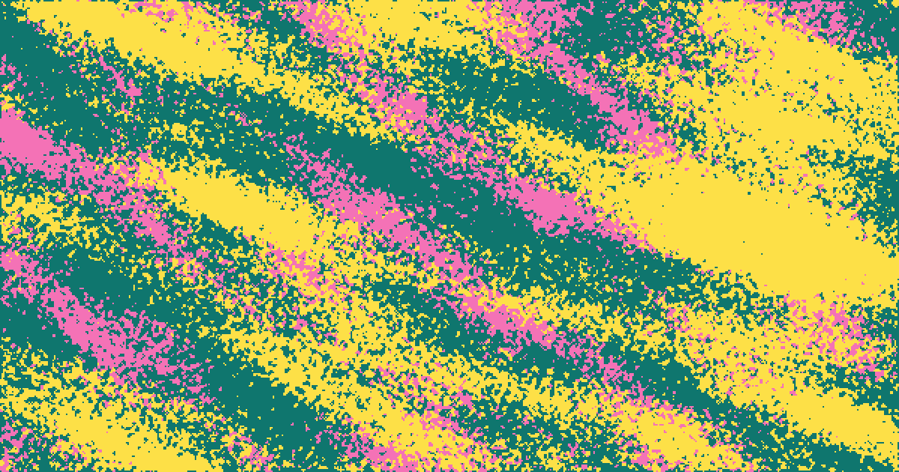
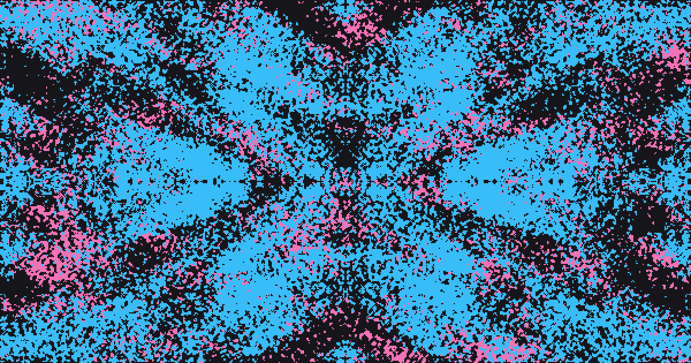
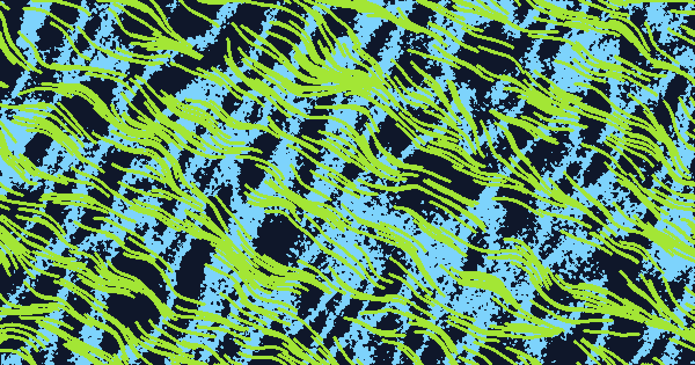

# Flield

A browser-based generator for seamless looping backgrounds. It builds
three-color pixel art, a background plus two artwork layers, from seeded flow
fields and symmetry, then sets it moving in a cycle that runs back into its
first frame with no cut. The name is a contraction of "flow field," the
mechanic it runs on.

## Live demo

[https://flield.com/](https://flield.com/)

## Screenshot

<!-- ?v= busts GitHub's and browsers' image cache for this file; bump it
     whenever screenshot.png is replaced, or a cached copy can outlive
     the actual file update for a while. -->

## Examples

Six exported GIFs, one per motion, each a single 3-second cycle at half the
app's own frame rate to keep the files small. Every setting and both seeds
hold; only the phase moves, and the last frame runs back into the first with
no cut.

<!-- HTML rather than a markdown table so the columns can be given equal
     widths; a markdown table sizes them by caption length, and the GIFs
     scale to whatever each column ends up with. Two columns, so each
     clip renders large, which these need since the motion is the whole
     point of them. -->
<table>
  <tr>
    <th width="50%">Loop</th>
    <th width="50%">Drift</th>
  </tr>
  <tr>
    <td width="50%"></td>
    <td width="50%"></td>
  </tr>
  <tr>
    <td width="50%">Each layer's flow field breathes around a small closed path, the two turning opposite ways, so they sway against each other and come back where they started.</td>
    <td width="50%">Orange bands slide one way and a cream nebula behind them slides the other, each along its own flow direction, and both wrap into themselves so they never jump.</td>
  </tr>
  <tr>
    <th width="50%">Wind</th>
    <th width="50%">Pulse</th>
  </tr>
  <tr>
    <td width="50%"></td>
    <td width="50%"></td>
  </tr>
  <tr>
    <td width="50%">The broad streaks hold their ground while a much broader gust bends them, rising and settling once across the cycle, and their fine detail streams through along the flow.</td>
    <td width="50%">Density swings on one sine wave, Layer B at 70% of the depth, so the contour lines swell and thin in weight and the streaks behind them breathe, without moving.</td>
  </tr>
  <tr>
    <th width="50%">Ripple</th>
    <th width="50%">Tide</th>
  </tr>
  <tr>
    <td width="50%"></td>
    <td width="50%"></td>
  </tr>
  <tr>
    <td width="50%">Rain on a marble: seven drops land at their own moments, and each ring bends and swells what it crosses, thins as it spreads, and adds where it meets another, while the field beneath never moves.</td>
    <td width="50%">Each layer's field is pushed along the other's ridges, rising and settling once per cycle, so the strands are swept along the nebula behind them and the nebula bends around the strands.</td>
  </tr>
</table>

## Purpose

Built to produce backgrounds and placeholder graphics without reaching for
stock footage, an animator, or a design tool every time. Swap in a brand
color palette, set a motion, and export a loop for a hero section or a hover
state. Stills work the same way without the motion: seed a batch of
variations and export the one that fits.

`generator.js` is independent of the UI, so the noise field, symmetry, and
grid logic can be reused elsewhere.

The [guide](https://flield.com/guide/) walks through every control with the
icon it carries in the app, and plays an example of each motion. The same
walkthrough is built into the app: the **?** button opens it, at the bottom
of the sidebar or the end of the settings panel on a phone.

## Features

### Generating

- A freshly randomized composition on every page load
- Two independent layers, each with its own seed, color, density, and directional flow field
- Six textures per layer, all reading one field: Streaks, Nebula and Marble bias how likely a cell is to fill, Contours draws the field's level lines, and Streamlines and Weave trace particles along it
- Eight symmetry modes, from 4-way mirror to 8-way kaleidoscope
- Shape masks (circle, diamond, vignette and its inverse, corner or side vignette, stripes), dithered along the edge rather than cut off
- Readable color by construction: layers held 35 degrees of hue apart, and 20 lightness points off the background
- A Tile preset for a square canvas that repeats with no visible seam

### Steering a result

- Per-field locks hold what you like steady while the rest rerolls
- Palette and density ranges bound how far a reroll can wander
- Auto-randomize on an interval, from one second to sixteen
- Undo walks back through recent passes, and never evicts the composition you started from
- The five actions that can't be walked back arm on a one-second hold, not a press

### Motion

- Loop, Drift, Wind, Pulse, Ripple, or Tide move a composition instead of replacing it, cycling back with no cut
- Plays on the canvas the moment you pick one, which is exactly what a GIF records
- Separate sliders for how fast it moves and how often it rerolls, both from one second to sixteen, with the reroll stepping in doublings
- Depth scales how far a motion goes, and Direction runs it backwards, so Drift and Wind can travel against the flow
- Collide makes the layers push on each other under any motion, and each layer can run a motion of its own

### Exporting and sharing

- PNG, SVG, or animated GIF, capped at 240 frames so a long export trades smoothness rather than size
- An SVG carries a link back to its own composition, so a file found later reopens in the editor
- Copy Link packs the whole composition, locks and motion included, into a URL of about a hundred characters
- Three browser save slots, each showing its three colors and when it was saved

### Interface

- On a phone, a bar within thumb reach and a sheet that stops short of the artwork, so a value can be judged against the result as it changes
- A thirteen-step tutorial with a live example at every step
- Keyboard shortcuts for the exploration loop: `R`, `Space`, `Cmd/Ctrl+Z`
- Dark by default, light on a toggle, remembered across visits
- A favicon regenerated on each load in the same three colors as the canvas
- Fully offline: every dependency vendored, no CDN, no network needed

## Background

Three explainers on how this works, each running the real generator live
rather than showing a screenshot of it:

- [What is a flow field?](https://flield.com/flow-fields/), on steering noise
  into directional streaks instead of static, and why the field biases
  density rather than gating it.
- [How to make a seamless tiling background](https://flield.com/seamless-backgrounds/),
  on why a 4-way mirror guarantees a tile repeats with no seam, and what
  breaks it.
- [How to make a looping animated background](https://flield.com/animated-backgrounds/),
  on the six motions, why they return to their first frame exactly, and
  which file format a hero background actually wants.

## Running locally

Flield is plain HTML, CSS, and JavaScript. No build step, no package manager.

1. Clone the repository
2. Serve the folder with any static file server, for example: `python3 -m http.server 8080`
3. Open `http://localhost:8080` in a browser

The guide is served alongside it at `http://localhost:8080/guide/`.

## How it works

Each layer's shape comes from a seeded value noise field, a small
Perlin-style implementation in `generator.js`, rotated and stretched into a
directional flow rather than isolated static.

That field biases each cell's fill probability instead of switching cells on
or off, which is what produces smooth density gradients across the canvas
rather than a hard scatter.

Symmetry applies last, as a mirror, rotation, or translation pass over the
finished grid. A shape mask, when set, constrains or fades the result with a
seeded dither along the transition, so the edge reads as part of the texture
instead of a clipped shape.

Grids are flat typed arrays, the field is cached between renders that don't
change it, and the canvas is painted once at cell resolution and scaled up.
A full-resolution render stays well under a frame at typical sizes.

## Credits

Flield is otherwise dependency-free; the one vendored third-party library is:

- [gif.js](https://github.com/jnordberg/gif.js) by Johan Nordberg, used for the animated GIF export (`vendor/gif/`). MIT licensed, see [vendor/gif/LICENSE](vendor/gif/LICENSE).

No other code is borrowed, but two public-domain algorithms in `generator.js` are built on published work rather than invented here:

- The flow field's noise (`makePerlin`) is [Ken Perlin](https://en.wikipedia.org/wiki/Ken_Perlin)'s gradient noise, using the fade curve from his 2002 SIGGRAPH paper, "Improved Noise reference implementation."
- The seeded PRNG (`mulberry32`) is [Tommy Ettinger](https://github.com/tommyettinger)'s public-domain generator of the same name.

## Contributing

Bug reports, feature suggestions, and small fixes are welcome. See [CONTRIBUTING.md](CONTRIBUTING.md) for how to get started, and [CODE_OF_CONDUCT.md](CODE_OF_CONDUCT.md) for community expectations.

## License

**The code** is under the [PolyForm Noncommercial License 1.0.0](LICENSE.md):
free to use, modify, and share for any noncommercial purpose. Building it into
a paid product or service needs a separate commercial license, so open a
[GitHub issue](https://github.com/simien/Flield/issues) to ask.

**The images you make with it are yours.** Use them anywhere, commercially
included, with no attribution required. The license covers this repository's
source code, not the artwork the tool produces.

