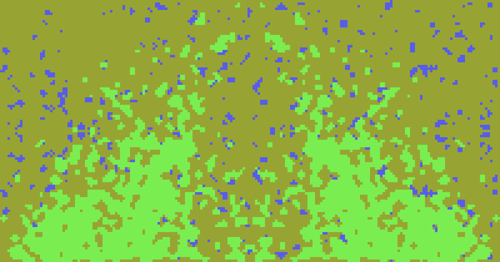
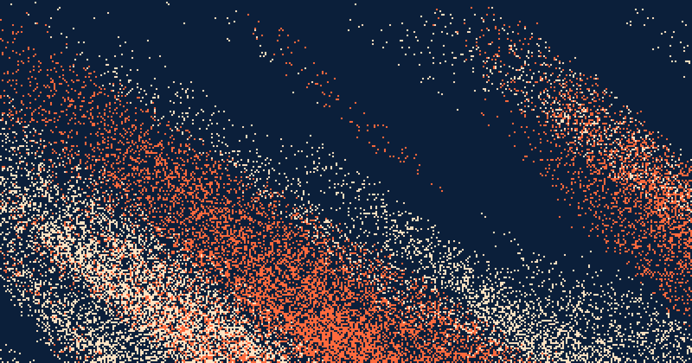
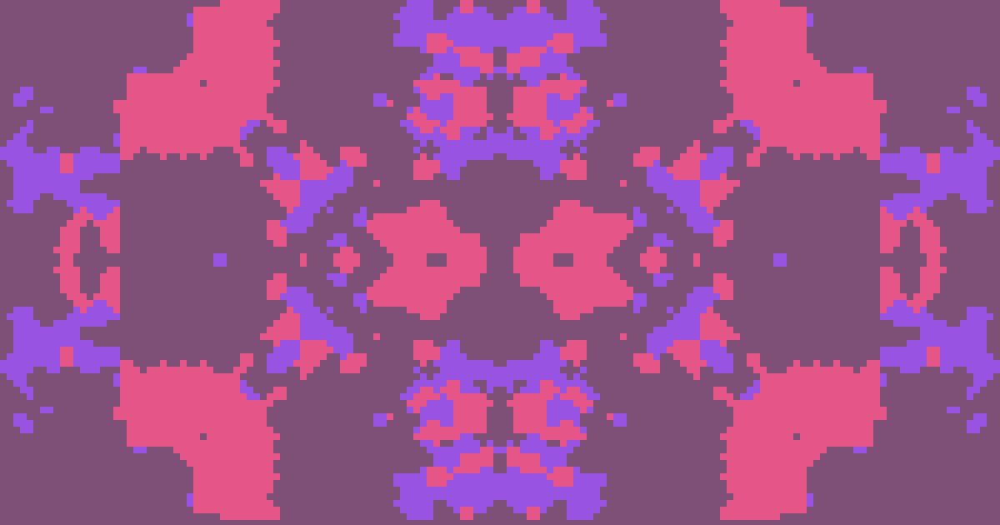
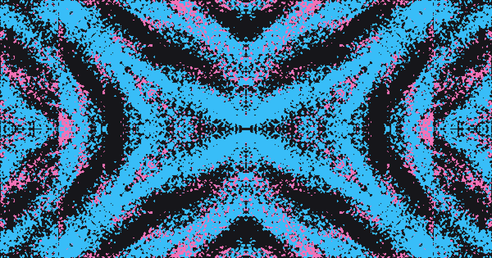
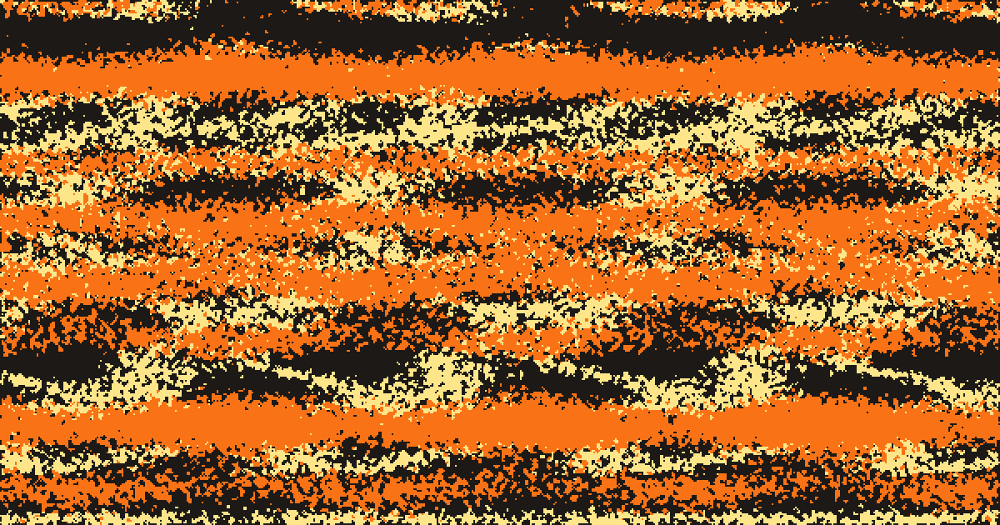
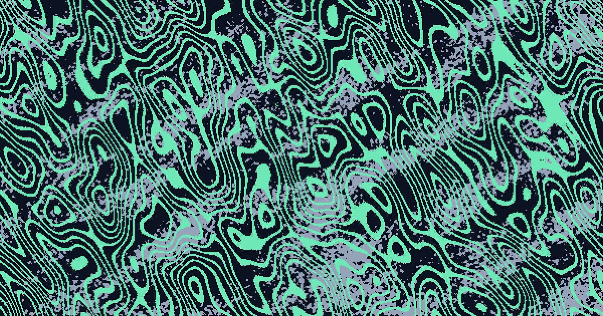

# Flield

A browser-based generative pixel art tool for creating unique three-color compositions (a background plus two artwork layers) from seeded flow fields and symmetry. The name is a contraction of "flow field," the noise mechanic the tool is built on.

## Live demo

[https://flield.com/](https://flield.com/)

## Screenshot

<!-- ?v= busts GitHub's and browsers' image cache for this file; bump it
     whenever screenshot.png is replaced, or a cached copy can outlive
     the actual file update for a while. -->

## Examples

Three exported GIFs, each thirteen Auto-randomize passes at a two-second interval, showing three ways to use the locks.

<!-- HTML rather than a markdown table so the three columns can be
     given equal widths; a markdown table sizes them by caption length,
     and the GIFs scale to whatever each column ends up with. -->
<table>
  <tr>
    <th width="33%">Full random</th>
    <th width="33%">Brand campaign</th>
    <th width="33%">Kaleidoscope variations</th>
  </tr>
  <tr>
    <td width="33%"></td>
    <td width="33%"></td>
    <td width="33%"></td>
  </tr>
  <tr>
    <td width="33%">Only block size and shape mask locked; every other field rerolls each pass.</td>
    <td width="33%">Fine diagonal streaks fading toward the bottom, colors and flow locked to a brand palette; only density and stretch drift, for a set of on-brand variations.</td>
    <td width="33%">A chunky 8-way kaleidoscope with symmetry, block size, density, and flow locked; seeds and colors reroll each pass, so every frame is a new pattern in the same language.</td>
  </tr>
</table>

Three more, one of each animated export kind, each a single 3-second cycle (at half the frame rate of the app's own export, to keep the files small). Every setting and both seeds hold; only the animation's phase moves, and the last frame runs back into the first with no cut.

<table>
  <tr>
    <th width="33%">Loop</th>
    <th width="33%">Drift</th>
    <th width="33%">Pulse</th>
  </tr>
  <tr>
    <td width="33%"></td>
    <td width="33%"></td>
    <td width="33%"></td>
  </tr>
  <tr>
    <td width="33%">The flow field breathes around a small closed path and comes back where it started, so the stripes of this 8-way kaleidoscope sway in place.</td>
    <td width="33%">The green bands slide one way along their flow direction and wrap into themselves, so they never jump; the sparse purple layer, with almost no field strength, holds still behind them.</td>
    <td width="33%">Density swings on one sine wave, Layer B at 70% of the depth, so the streaks swell and thin without moving.</td>
  </tr>
</table>

## Purpose

Built to generate images and placeholder graphics without reaching for stock photos or a design tool every time. Swap in a brand color palette, seed a batch of variations, and export the one that fits. The GIF export works well as a subtle animated background or hover state.

The generator itself (`generator.js`) is independent of the UI, so the noise field, symmetry, and grid logic can be reused in other projects.

See [USAGE.md](USAGE.md) for the sidebar walkthrough and a couple of techniques worth knowing, like locking fields to explore variations on one art direction with Auto-randomize. The same walkthrough is also built into the app itself: the **?** button (bottom of the sidebar, next to Copy Link) opens a short tutorial with a live example for each step.

## Features

- Every page load opens on a freshly randomized composition
- Randomize keeps the three colors readable: layers are steered at least 35 degrees of hue apart and 20 lightness points from the background (inside each layer's palette range), block size favors fine grids, and the loudest symmetry and mask options come up as occasional surprises rather than one roll in eight
- Two independently configurable color layers, each with its own seed, density, and directional flow field
- Eight symmetry modes: 4-way mirror, horizontal, vertical, 180-degree rotational, diagonal, 8-way kaleidoscope, tile, and none
- Optional shape masks, circle, diamond, vignette (and its inverse), a directional corner or side vignette, and stripes, each with a seeded dithered edge or fade instead of a hard cutoff
- A Tile dimension preset for a square canvas that repeats with no visible seam (not to be confused with the Tile symmetry mode above): shape mask off, both layers on 4-way mirror, so left edge matches right edge and top matches bottom exactly
- Palette range controls (hue, saturation, lightness) with five presets, plus fully custom ranges
- Density range controls, so a randomize pass can't drift all the way to a solid fill or an empty layer
- Per-field locks, covering every layer setting plus background color, block size, and shape mask, so a randomize pass can hold specific settings steady while re-rolling the rest
- Each sidebar tab shows a padlock when any of its fields are locked (solid once all of them are), so the state of a tab that isn't open stays visible
- Keyboard shortcuts for the exploration loop, listed under the canvas: R to randomize, Space to start or stop Auto-randomize, Cmd/Ctrl+Z to undo
- Undo steps back through recent randomize passes, including ones from autoplay or a GIF export
- A shareable link that encodes the exact composition, colors, both layers, and which fields are locked, into a URL; a menu beside Copy Link can make the link offer Auto-randomize to whoever opens it, with a prompt that also introduces the Play button
- Three save-state slots stored in the browser for revisiting a composition later, each showing its three colors and when it was saved
- Auto-randomize playback with an adjustable interval, from every 0.5 seconds up to every 10
- Export to PNG, SVG, or an animated GIF: a step count (3, 5, 8, or 13 Auto-randomize passes at the chosen speed), or a 3-second animation of the composition on screen that cycles back to its first frame with no cut, Loop (the flow field breathes around a closed path), Drift (it flows one way along the flow direction), Wind (it flows one way and bends as it goes, rising and settling like a gust), or Pulse (density swings), each previewed live on the canvas as soon as it is picked; a ×3 or ×5 variant records that many Auto-randomize passes, each animated that way
- A built-in tutorial, thirteen short steps with a live example each, covering Random, the sidebar, dimension presets, the shape mask, locks, palette and density ranges, Auto-randomize, Undo, saving and exporting, and the animated exports, with a canvas that runs a cycle of each kind; a first visit gets a small "Take the tour" prompt above the canvas rather than a modal
- Toast confirmations for actions that change something off-screen: Lock All / Unlock All, Undo, saving or loading a slot, and Copy Link
- Responsive sidebar that collapses into a toggleable drawer on narrow screens
- Dark theme by default, with a toggle for light, remembered across visits
- Fully offline: every dependency is vendored in the repo, no CDN, no network connection needed
- A generated favicon: the browser tab icon regenerates on every load, in the same three colors as the composition on screen

## Running locally

Flield is plain HTML, CSS, and JavaScript. No build step, no package manager.

1. Clone the repository
2. Serve the folder with any static file server, for example: `python3 -m http.server 8080`
3. Open `http://localhost:8080` in a browser

## How it works

Each layer's shape comes from a seeded value noise field (a small Perlin-style implementation in `generator.js`), rotated and stretched to create a directional flow instead of isolated static. That field biases each cell's fill probability rather than gating cells on or off directly, which produces smooth density gradients across the canvas. Grids are flat typed arrays, the field is cached between renders that don't change it, and the canvas is painted once at cell resolution and scaled up, so a full-resolution render stays well under a frame at typical sizes. Symmetry modes apply as a final mirror, rotation, or (for Tile) translation pass over the generated grid. A shape mask, when set, constrains or fades the composition, a circle, diamond, vignette, corner or side vignette, or stripes, with a seeded dither along the transition instead of a hard cutoff, so the edge reads as part of the texture rather than a clipped shape.

## Contributing

Bug reports, feature suggestions, and small fixes are welcome. See [CONTRIBUTING.md](CONTRIBUTING.md) for how to get started, and [CODE_OF_CONDUCT.md](CODE_OF_CONDUCT.md) for community expectations.

## License

Flield is licensed under the [PolyForm Noncommercial License 1.0.0](LICENSE.md): free to use, modify, and share for any noncommercial purpose (personal projects, hobby use, research, education). Commercial use, including embedding it in or basing a paid product or service on it, requires a separate commercial license. Open a [GitHub issue](https://github.com/simien/Flield/issues) to inquire.
