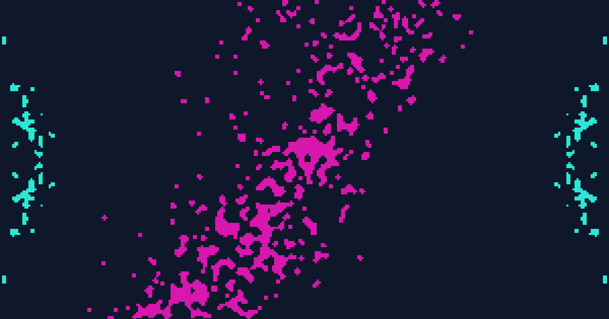
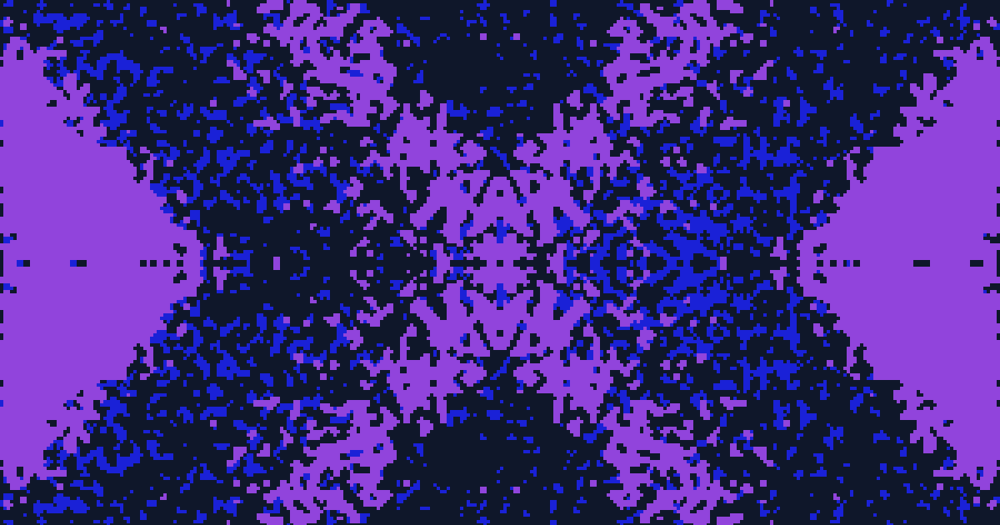
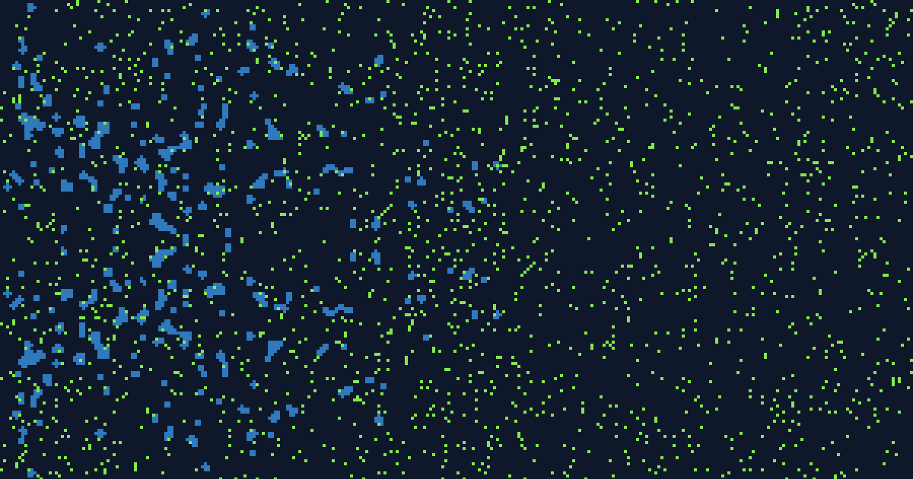
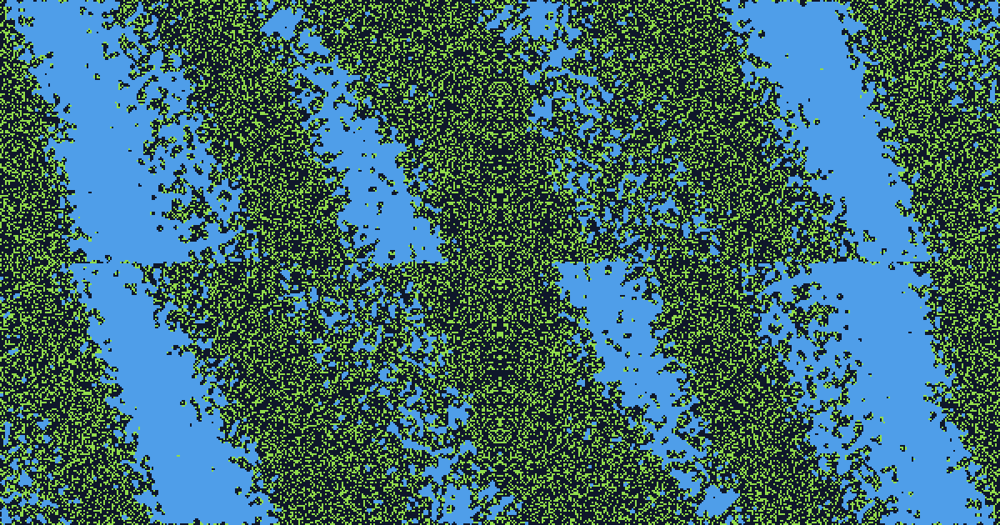
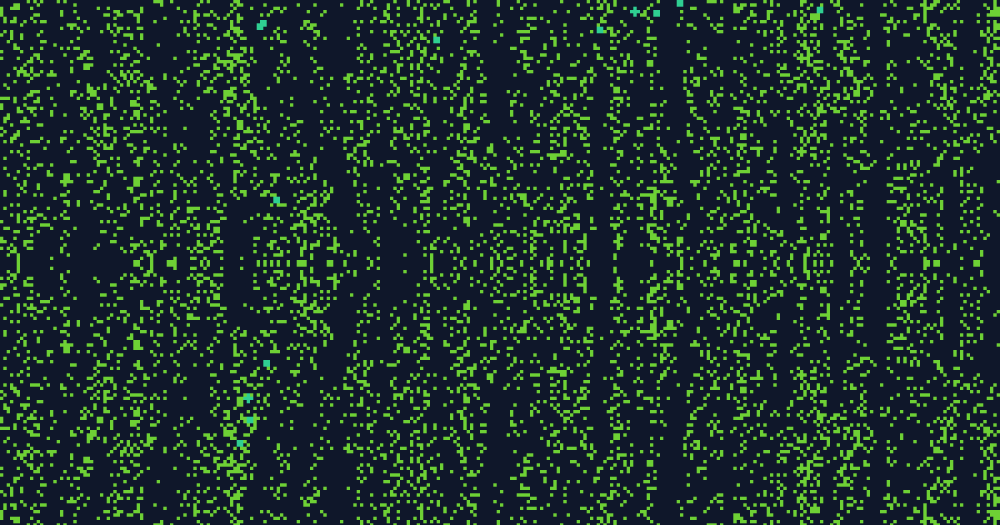
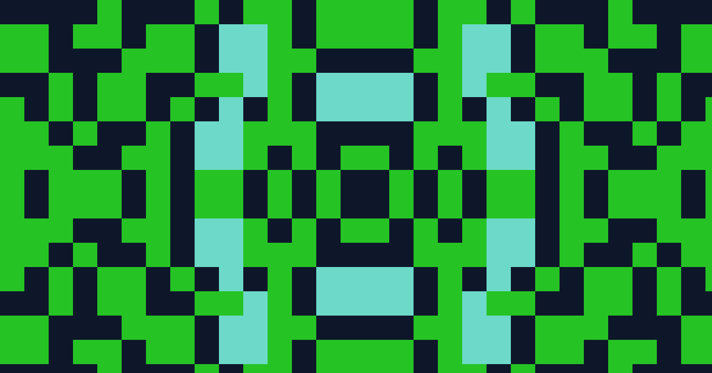
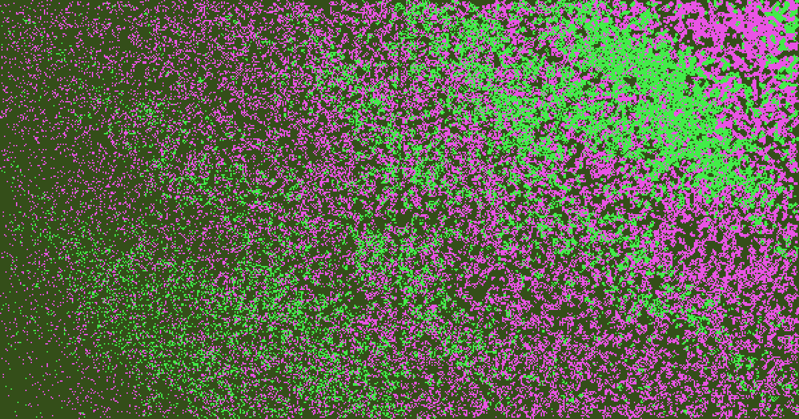
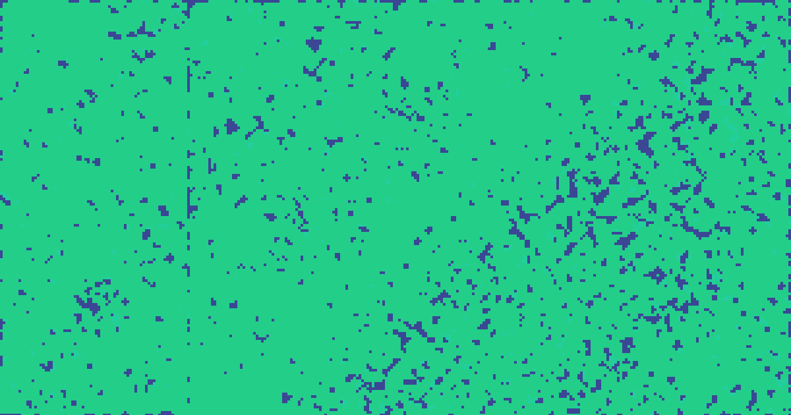
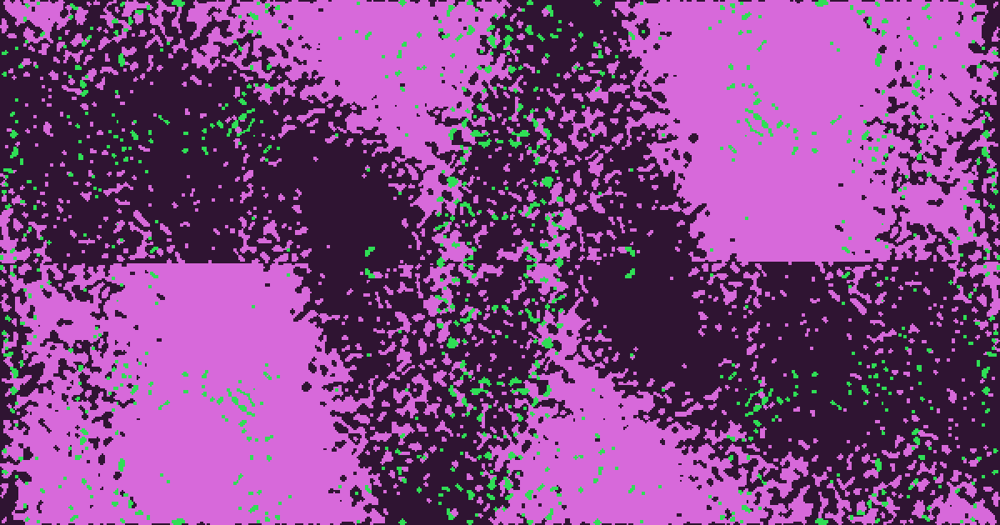

# Flield

*A contraction of "flow field," the seeded noise mechanic the tool is built on.*

A browser-based generative pixel art tool for creating unique three-color compositions (a background plus two artwork layers) from seeded flow fields and symmetry.

## Live demo

[https://simien.github.io/Flield/](https://simien.github.io/Flield/)

## Screenshot

## Examples

A few exported compositions, showing different symmetry modes, palettes, and densities.

| | | |
|---|---|---|
|  |  |  |
|  |  |  |
|  |  |  |

## Purpose

I built this to generate images and placeholder graphics without reaching for stock photos or a design tool every time. Swap in a brand color palette, seed a batch of variations, and export the one that fits. The GIF export works well as a subtle animated background or hover state.

The generator itself (`generator.js`) is independent of the UI, so the noise field, symmetry, and grid logic can be reused in other projects.

See [USAGE.md](USAGE.md) for the sidebar walkthrough and a couple of techniques worth knowing, like locking fields to explore variations on one art direction with Auto-randomize.

## Features

- Every page load opens on a freshly randomized composition
- Two independently configurable color layers, each with its own seed, density, and directional flow field
- Seven symmetry modes: 4-way mirror, horizontal, vertical, 180-degree rotational, diagonal, 8-way kaleidoscope, and none
- Palette range controls (hue, saturation, lightness) with five presets, plus fully custom ranges
- Density range controls, so a randomize pass can't drift all the way to a solid fill or an empty layer
- Per-field locks, covering every layer setting plus background color and block size, so a randomize pass can hold specific settings steady while re-rolling the rest
- Undo steps back through recent randomize passes, including ones from autoplay or a GIF export
- A shareable link that encodes the exact composition, colors, both layers, everything, into a URL
- Three save-state slots stored in the browser for revisiting a composition later
- Auto-randomize playback with an adjustable interval, from every 0.5 seconds up to every 10
- Export to PNG, SVG, or an animated GIF, with frame count (1, 2, 3, 5, 8, or 13) and speed both configurable
- Responsive sidebar that collapses into a toggleable drawer on narrow screens
- Fully offline: every dependency is vendored in the repo, no CDN, no network connection needed

## Running locally

Flield is plain HTML, CSS, and JavaScript. No build step, no package manager.

1. Clone the repository
2. Serve the folder with any static file server, for example: `python3 -m http.server 8080`
3. Open `http://localhost:8080` in a browser

## How it works

Each layer's shape comes from a seeded value noise field (a small Perlin-style implementation in `generator.js`), rotated and stretched to create a directional flow instead of isolated static. That field biases each cell's fill probability rather than gating cells on or off directly, which produces smooth density gradients across the canvas. Symmetry modes apply as a final mirror or rotation pass over the generated grid.
